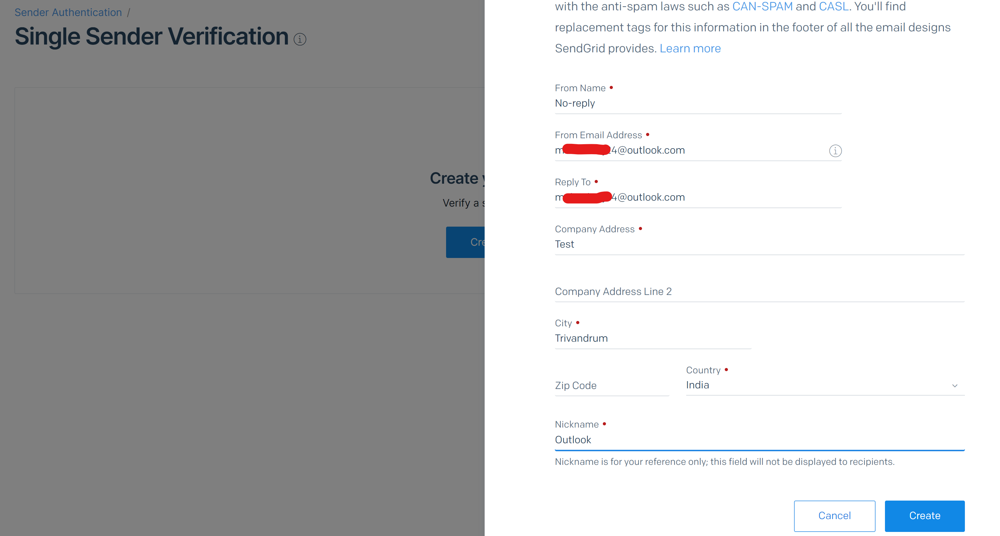

# CowinAvailabilityTracker

Console application which
- checks the availability of slots using [calendarByDistrict](https://apisetu.gov.in/public/marketplace/api/cowin/cowin-public-v2#/) API. (*API to get planned vaccination sessions for 7 days from a specific date in a given district.*)
- Notifies the user by sending an email with availability details.

Task Scheduler in Windows, is used to run the above console app at specific intervals.

## Arguments required for the cosole app

The console app requires a total of 4 command line arguments.
### 1. District ID
- Sample District Codes in Kerala
    - 301: Alappuzha
    - 307: Ernakulam
    - 306: Idukki
    - 297: Kannur
    - 295: Kasaragod
    - 298: Kollam
    - 304: Kottayam
    - 305: Kozhikode
    - 302: Malappuram
    - 308: Palakkad
    - 300: Pathanamthitta
    - 296: Thiruvananthapuram
    - 303: Thrissur
    - 299: Wayanad

- To find District ID for other states:
    - Go to the [Cowin Portal](https://www.cowin.gov.in/home) in your browser
    - Open the Network tab in browser
    - Search for vaccine availabilty in portal
    - Check the Network tab for request details
    - Find district_id property value from the details

- This [file](https://github.com/bhattbhavesh91/cowin-vaccination-slot-availability/blob/main/cowin-api-availability.ipynb) part of the repository bhattbhavesh91/cowin-vaccination-slot-availability seems to have a full list of District IDs listed.

### 2. SendGrid API Key
Obtained as part of pre-requisites. Check below.
### 3. From Email
The email address used to set up the Single Sender Identity as part of pre-requisites. Check below.
### 4. To Email
The email address to be notified. **Cannot be same as the From Email**.
## Pre-requisites

1. [.NET Core 3.1](https://dotnet.microsoft.com/download/dotnet/3.1) or later. Link to .NET Core 3.1 Runtime (v3.1.14) - [link](https://dotnet.microsoft.com/download/dotnet/thank-you/runtime-3.1.14-windows-x64-installer)
2. Create a [SendGrid](https://sendgrid.com/) account to send emails. (Free sign-up)
    1. You will be asked to verify the account / setup MFA.
    2. Create a 'Single Sender Identity' which will be used to send emails from. (Left navigation -> Marketing -> Senders) | [Tutorial](https://www.youtube.com/watch?v=hBMHe4h7iuo)
        1. You can use the same email ID you used to sign-up.
        2. You can provide the same email for the 'From Email Address' and 'Reply To' fields.
        
    3. Create an API Key with full access for simplicity. (Left navigation -> Settings -> API Keys)

## Usage

1. Download the contents of Executables folder.
    1. For non techies: 
        1. Download the repository by clicking on the green button with 'Code' and then on 'Download ZIP'.
        2. Extract the zip.
2. Open terminal or command prompt and change your directory to the 'Executables' folder you have just extracted.
3. Test the console app by using the below command.
    1. Make sure pre-requisites are in place.
```
CowinAvailabilityTracker.exe <DISTRICT ID> <SENDGRID API KEY> <FROM EMAIL> <TO EMAIL>
```
4. Open Task Scheduler in Windows. (Search for it in the start menu)
5. Click on 'Create Task' from Actions.
    1. In the General tab, provide a name for the task.
    
    2. In the Triggers tab, 
        1. Create a new trgger
        2. Set the schedule as you seem fit. The below screenshot is set to start running the task at 8 am everyday, 30 mins apart for 16 hours. (ie 8am - 12am the next day)
        
    3. In the Actions tab,
        1. In the Program/script field, browse and select the .exe file downloaded as part of step 1.
        2. In the Add arguments field, provide space separated command line arguments.
        ```
        <DISTRICT ID> <SENDGRID API KEY> <FROM EMAIL> <TO EMAIL>
        ```
        
    4. Optionally in the Settings tab, check the option - *Run task as soon as possible after a scheduled start is missed.*
        1. If this setting is checked, the Task Scheduler service will start the task if the task was scheduled to run at a certain time, but for some reason (for example, the computer was turned off or the Task Scheduler service was busy) the task was not activated.

## Usage (MacOS)

1. Download the contents of Executables folder.
2. Open Terminal and browse to the folder.
3. Run the following command:
    ```
    dotnet run CowinAvailabilityTracker.dll <DISTRICT ID> <SENDGRID API KEY> <FROM EMAIL> <TO EMAIL>
    ```
4. Optional: You can use Automator to run a Shell script at periodic intervals as well.
